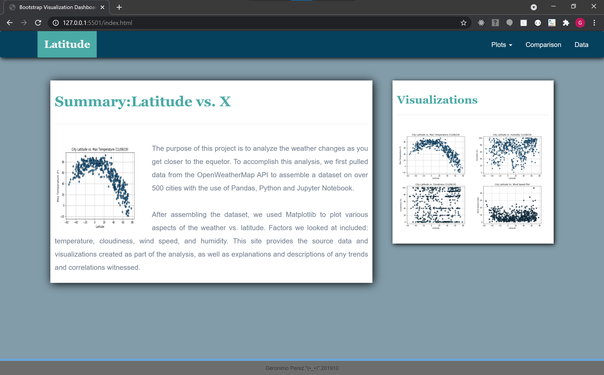
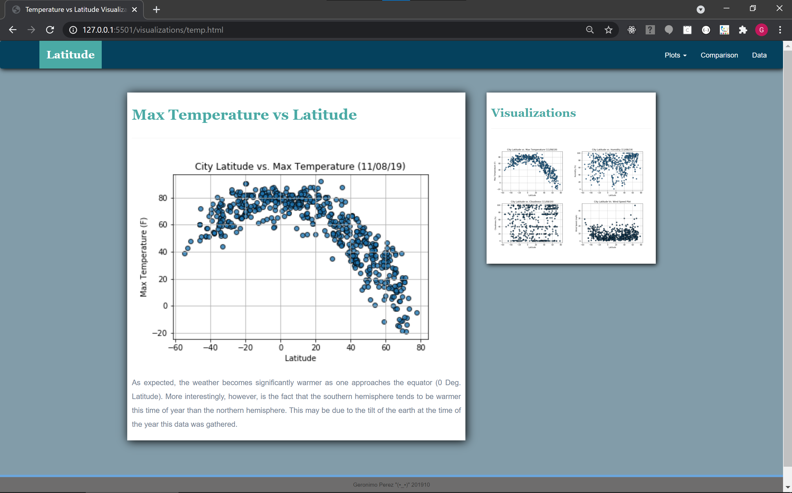
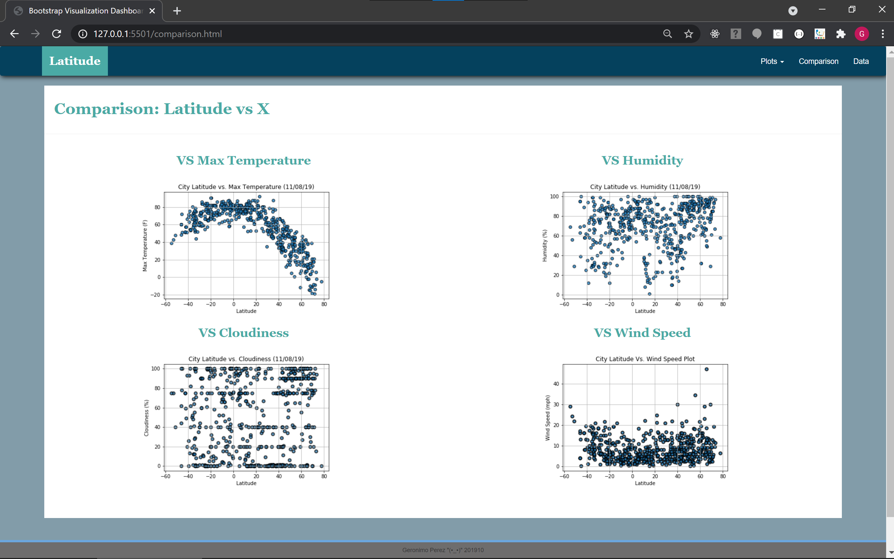

# <b>Visualization Dashboard Website</b>
The purpose of this project is to visualize the analysis of the weather changes as you get closer to the equator. To accomplish this, we first pulled data from the OpenWeatherMap API to assemble a dataset on over 500 cities with the use of Pandas, Python and Jupyter Notebook.

After assembling the dataset, we used Matplotlib to plot various aspects of the weather vs. latitude. Factors we looked at included: temperature, cloudiness, wind speed, and humidity. This site provides the source data and visualizations created as part of the analysis, as well as explanations and descriptions of any trends and correlations.

Created a visualization dashboard website using data explained above.  In building this dashboard, created individual pages for each plot and a means by which we can navigate between them. These pages contain the visualizations and their corresponding explanations. Also, have a landing page, a page where we can see a comparison of all of the plots, and another page where we can view the data used to build them.

The website consists of 7 pages total, with a navbar in every page and including the following:
* Bootstrap (outsourced CSS)
* A [landing page](#landing-page) containing:
  * An explanation of the project.
  * Links to each visualizations page.
* Four [visualization pages](#visualization-pages), each with:
  * A descriptive title and heading tag.
  * The plot/visualization itself for the selected comparison.
  * A paragraph describing the plot and its significance.
* A ["Comparisons" page](#comparisons-page) that:
  * Contains all of the visualizations on the same page so we can easily visually compare them.
  * Uses a bootstrap grid for the visualizations.
    * The grid must be two visualizations across on screens medium and larger, and 1 across on extra-small and small screens.
* A ["Data" page](#data-page) that:
  * Displays a responsive table containing the data used in the visualizations.
    * The data comes from exporting the `.csv` file converted as HTML with the use of Python and Pandas Library.

